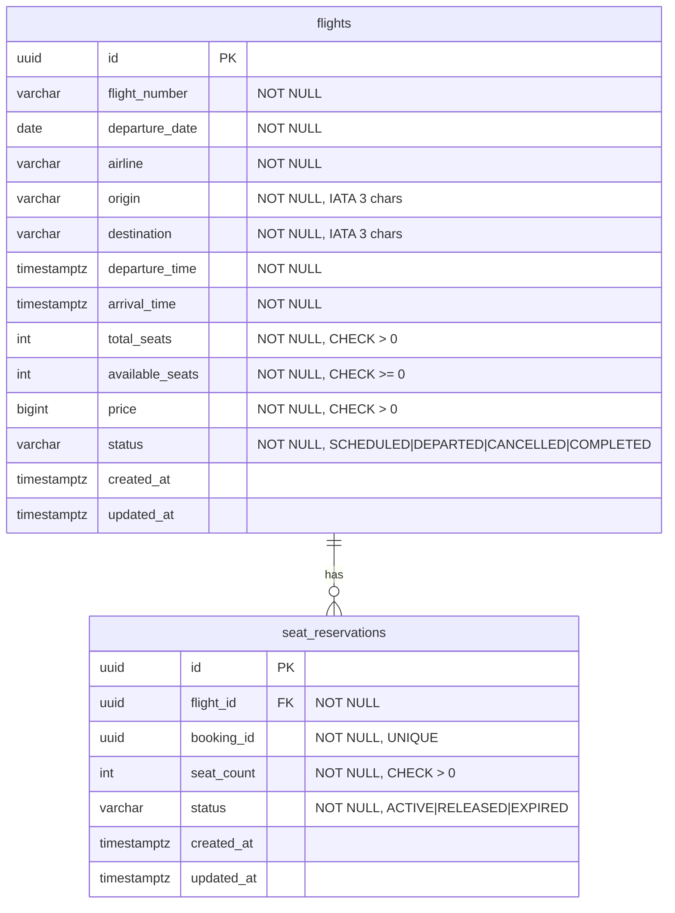
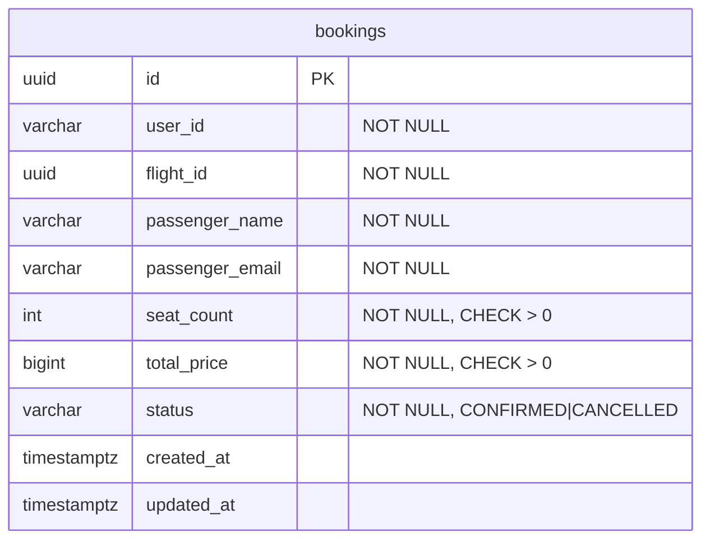

# ER Diagram (3NF)

## Flight Service Database

**Constraints:**
- `UNIQUE(flight_number, departure_date)` — one flight per number per day
- `available_seats <= total_seats`
- One `booking_id` maps to exactly one reservation (`UNIQUE(booking_id)`)

## Booking Service Database

**Notes:**
- `flight_id` references Flight Service logically (no cross-DB FK)
- `total_price` is a snapshot at booking time (`seat_count * flight.price`)
